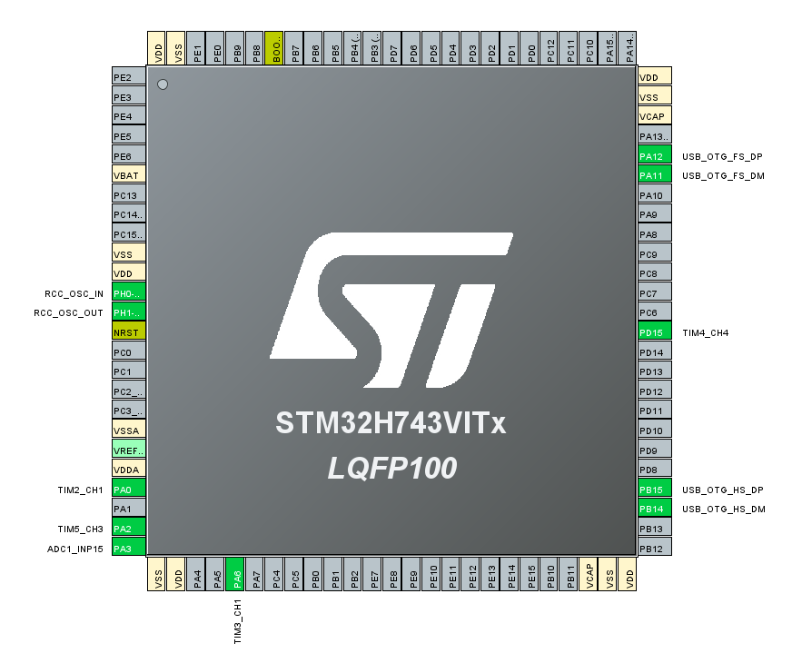
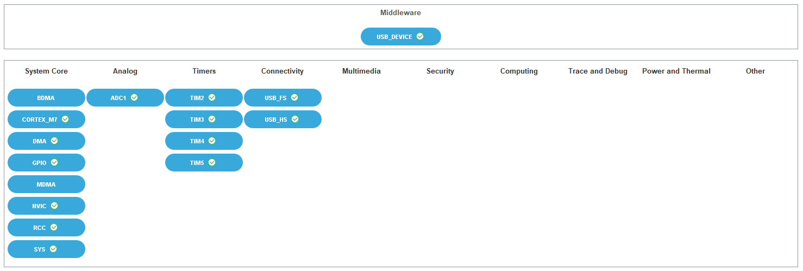

# TCD1304 Linear CCD Driver for STM32H743

A complete driver for the Toshiba TCD1304 linear CCD sensor using the STM32H743VIT6 microcontroller.

Based on the [CuriousScientist TCD1304 Tutorial](https://curiousscientist.tech/blog/tcd1304-linear-ccd-driving-the-ccd), adapted for the STM32H7 series.

---

## 📋 Table of Contents

- [Overview](#overview)
- [STM32CubeMX Configuration](#stm32cubemx-configuration)
- [Hardware Requirements](#hardware-requirements)
- [Pin Configuration](#pin-configuration)
- [Clock Configuration](#clock-configuration)
- [Timer Configuration](#timer-configuration)
- [ADC Configuration](#adc-configuration)
- [Signal Specifications](#signal-specifications)
- [Wiring Diagram](#wiring-diagram)
- [USB Commands](#usb-commands)
- [Expected Oscilloscope Readings](#expected-oscilloscope-readings)
- [Troubleshooting](#troubleshooting)

---

## Overview

The TCD1304 is a 3648-pixel linear CCD sensor commonly used in spectrometers and barcode scanners. This project drives the CCD using hardware timers and captures the analog output using DMA-based ADC conversion.

### Key Features

- **3648 active pixels** + 46 dummy pixels (3694 total)
- **Electronic shutter** function for variable integration time
- **USB Virtual COM Port** for data transmission
- **DMA-based ADC** for CPU-efficient data capture
- **Configurable integration time** (20µs to 7500µs)

---

## STM32CubeMX Configuration

### Pinout View

The following image shows the STM32H743VIT6 pinout configuration in STM32CubeMX:



Key pins highlighted:
- **PA0** - TIM2_CH1 (ICG signal)
- **PA2** - TIM5_CH3 (SH signal)
- **PA3** - ADC1_INP15 (CCD analog output)
- **PA6** - TIM3_CH1 (ϕM master clock)
- **PA11/PA12** - USB OTG FS
- **PD15** - TIM4_CH4 (ADC trigger)
- **PH0/PH1** - HSE oscillator

### System View

The STM32CubeMX system configuration showing enabled peripherals and middleware:



**Enabled Components:**
- **System Core:** DMA, CORTEX_M7, FMC, GPIO, MDMA, NVIC, RCC, SYS
- **Analog:** ADC1
- **Timers:** TIM2, TIM3, TIM4, TIM5
- **Connectivity:** USB_FS, USB_HS
- **Middleware:** USB_DEVICE (CDC class)

---

## Hardware Requirements

| Component | Specification | Notes |
|-----------|--------------|-------|
| **MCU** | STM32H743VIT6 | LQFP100 package |
| **Crystal** | 25 MHz HSE | External oscillator |
| **CCD Sensor** | TCD1304AP | Toshiba linear CCD |
| **HEX Inverter** | 74HC04 | Signal inversion (VCC = 3.3V) |
| **USB Cable** | Micro USB | For CDC communication |

### Optional Level Shifting (if TCD1304 runs at 5V)

| Option | Components |
|--------|------------|
| Two-stage inverter | 2x 74HC04 (one at 3.3V, one at 5V) |
| Transistor shifter | 3x 2N7000 + 3x 4.7kΩ |
| Level shifter IC | 74HCT04 or 74AHCT125 |

---

## Pin Configuration

### STM32H743 Pin Mapping

| Function | Pin | Timer/Peripheral | AF (Alternate Function) |
|----------|-----|------------------|-------------------------|
| **ϕM (Master Clock)** | PA6 | TIM3_CH1 | AF2 |
| **ICG (Integration Clear Gate)** | PA0 | TIM2_CH1 | AF1 |
| **SH (Shift Gate)** | PA2 | TIM5_CH3 | AF2 |
| **ADC Input (OS)** | PA3 | ADC1_INP15 | Analog |
| **ADC Trigger** | PD15 | TIM4_CH4 | Internal |
| **USB D-** | PA11 | USB_OTG_FS | - |
| **USB D+** | PA12 | USB_OTG_FS | - |
| **HSE IN** | PH0 | RCC_OSC_IN | - |
| **HSE OUT** | PH1 | RCC_OSC_OUT | - |

### GPIO Summary

```
PA0  ──────► ICG Output (TIM2_CH1)
PA2  ──────► SH Output (TIM5_CH3)
PA3  ◄────── CCD OS Input (ADC1_INP15)
PA6  ──────► ϕM Output (TIM3_CH1)
PA11 ◄─────► USB D-
PA12 ◄─────► USB D+
PD15 ──────► ADC Trigger (TIM4_CH4) [Internal]
```

---

## Clock Configuration

### System Clocks

| Clock | Frequency | Source |
|-------|-----------|--------|
| **HSE** | 25 MHz | External Crystal |
| **SYSCLK** | 120 MHz | PLL1 |
| **HCLK** | 120 MHz | SYSCLK/1 |
| **APB1** | 120 MHz | HCLK/1 |
| **APB2** | 120 MHz | HCLK/1 |
| **USB** | 48 MHz | PLL1Q |
| **ADC** | 75 MHz | PLL2P |

### PLL Configuration

```
PLL1:
  - Source: HSE (25 MHz)
  - DIVM1: 5 → VCO Input = 5 MHz
  - DIVN1: 48 → VCO Output = 240 MHz
  - DIVP1: 2 → SYSCLK = 120 MHz
  - DIVQ1: 5 → USB = 48 MHz

PLL2:
  - Source: HSE (25 MHz)
  - DIVM2: 2 → VCO Input = 12.5 MHz
  - DIVN2: 12 → VCO Output = 150 MHz
  - DIVP2: 2 → ADC = 75 MHz
```

### Timer Clock

All timers (TIM2, TIM3, TIM4, TIM5) run at **120 MHz** (APB1/APB2 timer clock).

**One timer tick = 1/120 MHz = 8.333 ns**

---

## Timer Configuration

### TIM3 - Master Clock (ϕM)

Generates the 2 MHz master clock for the CCD shift register.

| Parameter | Value | Calculation |
|-----------|-------|-------------|
| **Prescaler** | 0 | No prescaling |
| **Period (ARR)** | 60-1 = 59 | 120 MHz / 60 = 2 MHz |
| **Pulse (CCR)** | 30 | 50% duty cycle |
| **Polarity** | LOW | Inverted (for HEX inverter) |
| **Output Frequency** | **2.000 MHz** | ✓ |

### TIM4 - ADC Trigger

Generates the 500 kHz trigger for ADC sampling (1 sample per 4 ϕM cycles).

| Parameter | Value | Calculation |
|-----------|-------|-------------|
| **Prescaler** | 0 | No prescaling |
| **Period (ARR)** | 240-1 = 239 | 120 MHz / 240 = 500 kHz |
| **Pulse (CCR)** | 60 | 25% duty cycle |
| **Polarity** | HIGH | Rising edge trigger |
| **Output Frequency** | **500 kHz** | ✓ |
| **Channel** | CH4 | Triggers ADC externally |

### TIM2 - ICG (Integration Clear Gate)

Controls the readout cycle. Period = 7500 µs (133.33 Hz).

| Parameter | Value | Calculation |
|-----------|-------|-------------|
| **Prescaler** | 0 | No prescaling |
| **Period (ARR)** | 900000-1 | 120 MHz / 900000 = 133.33 Hz |
| **Pulse (CCR)** | 1200-1 = 1199 | 10 µs pulse width |
| **Polarity** | HIGH | (Inverted by HEX inverter) |
| **Output Frequency** | **133.33 Hz** | ✓ |
| **Master Mode** | Enable | Triggers TIM5 |
| **Trigger Output** | TIM_TRGO_ENABLE | On counter enable |

**ICG Timing:**
- Period: 7500 µs (7.5 ms)
- Pulse Width: 10 µs
- Duty Cycle: 0.133%

### TIM5 - SH (Shift Gate)

Controls integration time. Slave to TIM2 via ITR0.

| Parameter | Value | Calculation |
|-----------|-------|-------------|
| **Prescaler** | 0 | No prescaling |
| **Period (ARR)** | 2400-1 = 2399 | 120 MHz / 2400 = 50 kHz (20 µs) |
| **Pulse (CCR)** | 480-1 = 479 | 4 µs pulse width |
| **Polarity** | LOW | (Inverted by HEX inverter) |
| **Output Frequency** | **50 kHz** | ✓ |
| **Slave Mode** | Trigger | Started by TIM2 |
| **Trigger Source** | ITR0 | TIM2 is master |

**SH Timing (default 20 µs integration):**
- Period: 20 µs
- Pulse Width: 4 µs
- Duty Cycle: 20%

### Timer Relationship Diagram

```
TIM2 (ICG) ────────────────────────────────────────────────────►
           │                                                    │
           │  7500 µs period (133.33 Hz)                        │
           │                                                    │
           ▼ TRGO_ENABLE                                        ▼
TIM5 (SH)  ┌─┐┌─┐┌─┐┌─┐┌─┐┌─┐┌─┐┌─┐┌─┐ ... ┌─┐┌─┐┌─┐┌─┐┌─┐┌─┐┌─┐
           └─┘└─┘└─┘└─┘└─┘└─┘└─┘└─┘└─┘     └─┘└─┘└─┘└─┘└─┘└─┘└─┘
           │  20 µs per cycle (50 kHz)                          │
           │                                                    │
           ◄────────── Integration Time ──────────────────────►
```

---

## ADC Configuration

### ADC1 Settings

| Parameter | Value |
|-----------|-------|
| **Resolution** | 16-bit |
| **Clock** | 75 MHz (Async DIV2) |
| **Sampling Time** | 2.5 cycles |
| **Trigger Source** | TIM4 CC4 Event |
| **Trigger Edge** | Rising |
| **Conversion Mode** | Single |
| **DMA Mode** | Circular |
| **Overrun** | Data Overwritten |

### DMA Configuration

| Parameter | Value |
|-----------|-------|
| **Stream** | DMA1_Stream0 |
| **Direction** | Peripheral to Memory |
| **Mode** | Circular |
| **Data Width** | Half Word (16-bit) |
| **Memory Increment** | Enable |
| **Priority** | Low |

### Buffer

```c
#define CCD_BUFFER_SIZE 3694  // 32 + 3648 + 14 pixels
__attribute__((aligned(32))) uint16_t CCDPixelBuffer[CCD_BUFFER_SIZE];
```

**Note:** Buffer is 32-byte aligned for STM32H7 cache coherency.

---

## Signal Specifications

### ⏱️ Timer & Signal Specifications (Final Working Setup)

| Signal | Timer | Pin | Freq | Pulse Width | Polarity (STM32) | Mode |
| :--- | :--- | :--- | :--- | :--- | :--- | :--- |
| **ϕM** | TIM3 | PA6 | 2.000 MHz | 50% Duty | LOW | Independent |
| **ICG** | TIM2 | PA0 | 133.33 Hz | 10.0 µs | **HIGH** | **Master** (TRGO_ENABLE) |
| **SH** | TIM5 | PA2 | 50.00 kHz | 4.0 µs | **HIGH** | **Slave** (Reset Mode) |
| **ADC** | TIM4 | INT | 500.0 kHz | 25% Duty | HIGH | Independent |

#### ⚠️ Critical Hardware-Software Link:
Since this project uses a **74HC04 HEX Inverter** for level shifting (3.3V to 5V), the signals are physically inverted.
*   **Code Setting:** Polarity = **HIGH** (STM32 sends a High Pulse).
*   **Result at Sensor:** Polarity = **LOW** (Sensor receives the required **Active-Low** pulse).

#### 🔗 Master-Slave Synchronization:
To ensure the SH (Shift Gate) pulse never drifts relative to the ICG (Integration Clear Gate) pulse:
1.  **TIM2 (Master)** is set to `Trigger Event: Enable`.
2.  **TIM5 (Slave)** is set to `Slave Mode: Reset Mode` via `ITR0`.
3.  This ensures TIM5 is force-synchronized every 7.5ms frame.
4.  **Timer Startup Sequence**:
    The order in `main.c` is critical for high-speed MCUs like the H7:
    ```c
    HAL_TIM_PWM_Start(&htim5, TIM_CHANNEL_3); // 1. ARM SLAVE FIRST
    HAL_TIM_PWM_Start(&htim2, TIM_CHANNEL_1); // 2. START MASTER
    __HAL_TIM_SET_COUNTER(&htim2, 72);         // 3. SET 600ns OFFSET
    ```

### 🛠️ Troubleshooting & Debugging

If the SH signal (PA2) is missing or out of sync:
1.  **Check Startup Order**: If TIM2 starts before TIM5 is armed, the slave will miss the trigger.
2.  **Reset Mode vs Trigger Mode**: While many tutorials use "Trigger Mode," **Reset Mode** is significantly more stable as it re-syncs the clocks every frame.
3.  **MSM Bit**: On STM32H7, leaving Master/Slave Mode (MSM) **Disabled** on the Slave timer (TIM5) prevents a common hardware-stall issue.
4.  **Polarity**: If using a MOSFET or Inverter for level shifting, double-check if your pulse is pulsing the "wrong way" at the sensor. The TCD1304 pulses MUST be Active-Low at the sensor pins.

---

## Wiring Diagram

### STM32H743 to 74HC04 to TCD1304

```
                    74HC04 (VCC = 3.3V)
                    ┌─────────────────┐
STM32 PA6 (ϕM)  ────┤1A            1Y├──────► TCD1304 Pin 3 (ϕM)
                    │                 │
STM32 PA0 (ICG) ────┤2A            2Y├──────► TCD1304 Pin 2 (ICG)
                    │                 │
STM32 PA2 (SH)  ────┤3A            3Y├──────► TCD1304 Pin 4 (SH)
                    │                 │
              GND ──┤GND          VCC├────── 3.3V
                    └─────────────────┘

TCD1304 Pin 5 (OS) ──────────────────────────► STM32 PA3 (ADC Input)
TCD1304 Pin 1 (GND) ─────────────────────────► GND
TCD1304 Pin 6 (VDD) ─────────────────────────► 3.3V or 5V (see note)
```

### Power Supply Notes

| Configuration | 74HC04 VCC | TCD1304 VDD | Notes |
|--------------|------------|-------------|-------|
| All 3.3V | 3.3V | 3.3V | Simplest, may work |
| Mixed (risky) | 3.3V | 5V | 3.3V may be low for TCD1304 VIH |
| Level shifted | 5V (74HCT04) | 5V | Most reliable |

---

## USB Commands

Connect via serial terminal (115200 baud, 8N1).

| Command | Description |
|---------|-------------|
| `shot` | Capture and send one frame |
| `stream` | Start continuous streaming |
| `stop` | Stop streaming |
| `status` | Show debug info (sample pixel values) |
| `check` | Show timer ARR values (TIM3, TIM2, TIM5) |

### Data Format

```
START_FRAME
0,value0
1,value1
2,value2
...
3693,value3693
END_FRAME
```

Values are 16-bit unsigned integers (0-65535 for 16-bit ADC).

---

## Expected Oscilloscope Readings

### ϕM (Master Clock) - PA6

- **Frequency:** 2.000 MHz
- **Period:** 500 ns
- **Duty Cycle:** 50%
- **Amplitude:** ~3.3V Pk-Pk
- **Waveform:** Square wave

### ICG (Integration Clear Gate) - PA0

- **Frequency:** 133.33 Hz
- **Period:** 7.5 ms
- **Duty Cycle:** 0.13% (very narrow pulse)
- **Amplitude:** ~3.3V Pk-Pk
- **Waveform:** Mostly LOW with narrow HIGH pulse

### SH (Shift Gate) - PA2

- **Frequency:** 50 kHz (at 20 µs integration time)
- **Period:** 20 µs
- **Duty Cycle:** 20%
- **Amplitude:** ~3.3V Pk-Pk
- **Waveform:** Square wave

---

## Troubleshooting

### No Signal on SH (PA2)

TIM5 is in **slave mode** and waits for TIM2 to trigger it.

**Check:**
1. TIM2 is running (verify ICG signal on PA0)
2. Timer start sequence in code:
   ```c
   HAL_TIM_PWM_Start(&htim3, TIM_CHANNEL_1);  // ϕM
   HAL_TIM_PWM_Start(&htim4, TIM_CHANNEL_4);  // ADC
   HAL_TIM_PWM_Start(&htim2, TIM_CHANNEL_1);  // ICG
   __HAL_TIM_SET_COUNTER(&htim2, 72);         // Delay
   HAL_TIM_PWM_Start(&htim5, TIM_CHANNEL_3);  // SH
   ```

### 50 Hz Sinusoidal Signal

This is **AC mains interference**, not the actual signal.

**Check:**
- Oscilloscope probe ground clip is connected
- Probe tip is touching the correct pin (PA2)

### ADC Values All Zero or Saturated

**Check:**
1. DMA is initialized BEFORE ADC in `main()`
2. Cache invalidation after DMA:
   ```c
   SCB_CleanInvalidateDCache_by_Addr((uint32_t*)CCDPixelBuffer, CCD_BUFFER_SIZE * 2);
   ```
3. TCD1304 is powered correctly
4. OS pin is connected to PA3

### USB Not Detected

**Check:**
1. USB cable supports data (not charge-only)
2. USB OTG FS is configured in Device Only mode
3. CDC class is selected in USB_DEVICE middleware

---

## Integration Time Adjustment

To change integration time, modify TIM5 period:

| Integration Time | TIM5 Period (ARR) | Frequency |
|-----------------|-------------------|-----------|
| 10 µs | 1200-1 | 100 kHz |
| 20 µs | 2400-1 | 50 kHz |
| 50 µs | 6000-1 | 20 kHz |
| 100 µs | 12000-1 | 10 kHz |
| 500 µs | 60000-1 | 2 kHz |
| 1000 µs (1 ms) | 120000-1 | 1 kHz |
| 7500 µs (max) | 900000-1 | 133.33 Hz |

**Formula:** `ARR = (Integration_Time_µs × 120) - 1`

---

## References

- [CuriousScientist TCD1304 Tutorial](https://curiousscientist.tech/blog/tcd1304-linear-ccd-driving-the-ccd)
- [TCD1304 Datasheet](https://toshiba.semicon-storage.com/info/TCD1304AP_datasheet_en_20070831.pdf)
- [STM32H743 Reference Manual (RM0433)](https://www.st.com/resource/en/reference_manual/rm0433-stm32h742-stm32h743-stm32h750-and-stm32h753-advanced-armbased-32bit-mcus-stmicroelectronics.pdf)
- [STM32H743 Datasheet](https://www.st.com/resource/en/datasheet/stm32h743vi.pdf)

---

## License

This project is provided as-is for educational purposes.

---

## Version History

| Version | Date | Changes |
|---------|------|---------|
| 1.0 | 2026-01-19 | Initial release for STM32H743 |
